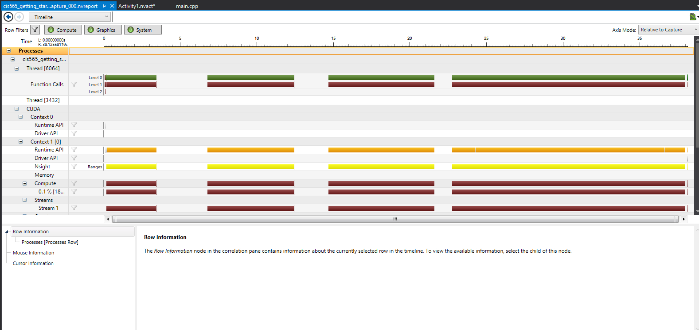
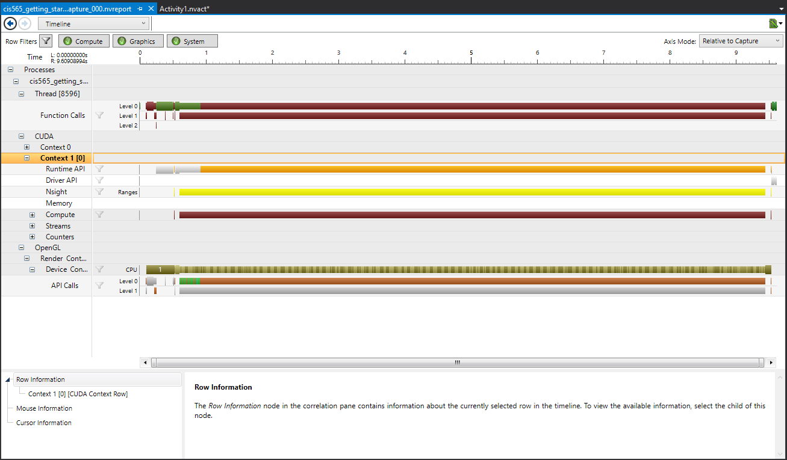

CUDA Getting Started
====================

**University of Pennsylvania, CIS 565: GPU Programming and Architecture, Project 0**

* Tongbo Sui
* Tested on: Windows 10, i5-3320M @ 2.60GHz 8GB, NVS 5400M 2GB (Personal)

## Screenshots
### Part 4

### Part 5

