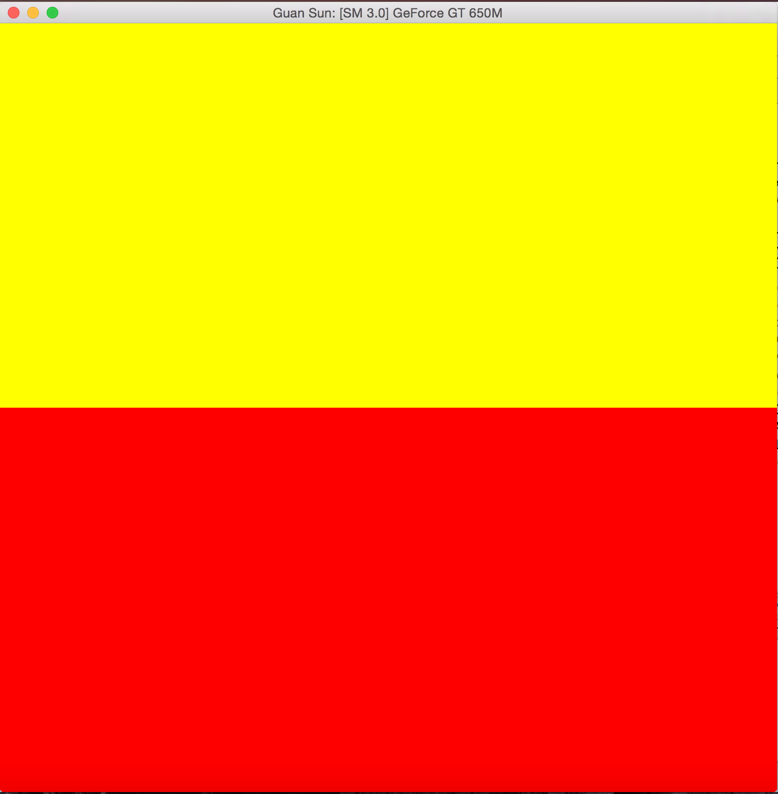
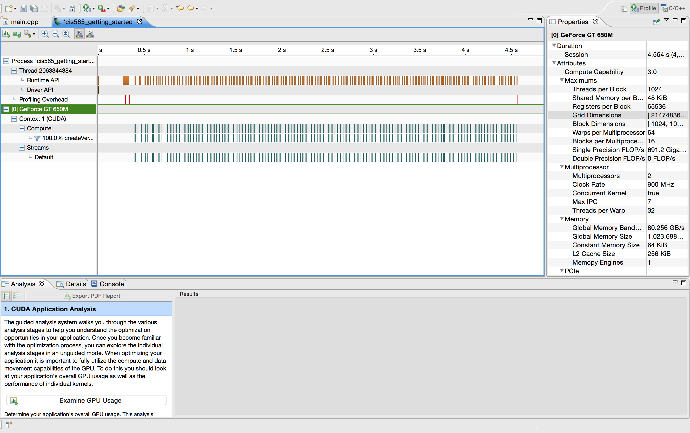

CUDA Getting Started
====================

**University of Pennsylvania, CIS 565: GPU Programming and Architecture, Project 0**

* Guan Sun
* Tested on: Mac OS X Yosemite 10.10.5, Intel Core i7 @ 2.3GHz 8GB, GeForce GT 650M 1024MB (Personal Laptop)

Include screenshots, analysis, etc. (Remember, this is public, so don't put anything here that you don't want to
share with the world.)

**Part 4: Modify**

**Part 5: Analyze**

