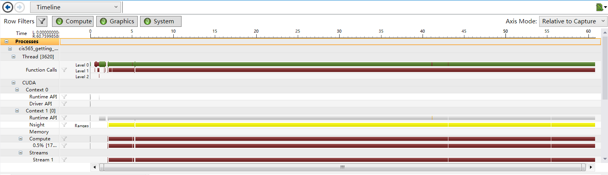
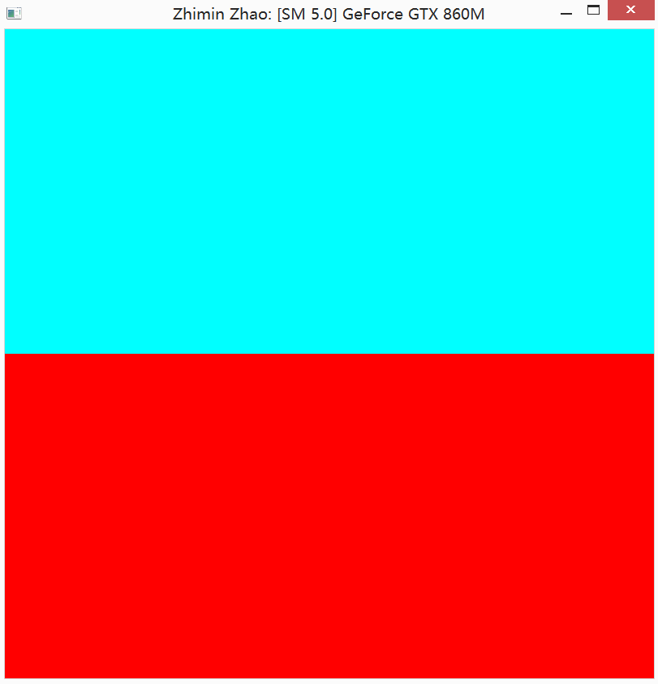

#CUDA Getting Started

University of Pennsylvania, CIS 565: GPU Programming and Architecture, Project 0

Zhimin Zhao

Tested on: Windows 8.1, i7-4710HQ @ 2.50GHz 16GB, 2 x GTX 860 4096MB (Personal Computer)

