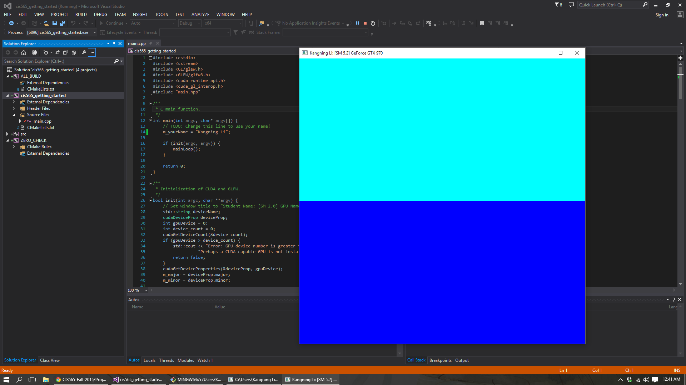
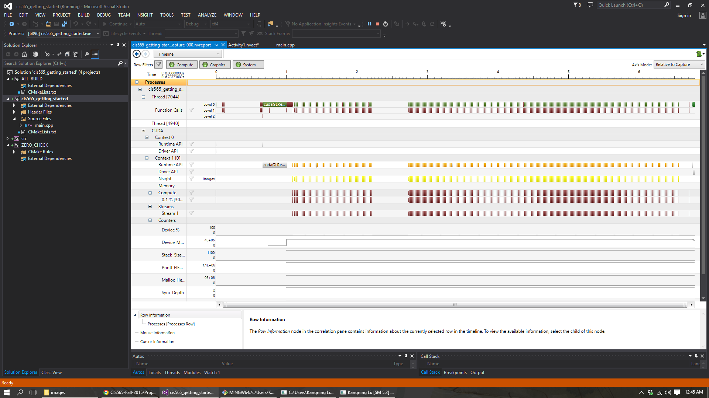

CUDA Getting Started
====================

**University of Pennsylvania, CIS 565: GPU Programming and Architecture, Project 0**

* Kangning Li
* Tested on: September 01, 2015 Windows 10, i7-4790 @ 3.6GHz 16GB, GTX 970 4096MB (Personal)

Include screenshots, analysis, etc. (Remember, this is public, so don't put
anything here that you don't want to share with the world.)

**Summary:** This project is a simple program that demonstrates CUDA and OpenGL functionality
and interoperability, testing that CUDA has been properly installed. If the
machine you are working on has CUDA and OpenGL 4.0 support, then when you run
the program, you should see either one or two colors depending on your
graphics card.

Screenshots include a shot of the program running with my name in the title bar and a shot of the Nsight profiler's output within Visual Studio 2013.

