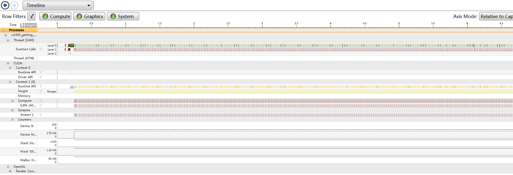

CUDA Getting Started
====================

**University of Pennsylvania, CIS 565: GPU Programming and Architecture, Project 0**

* Hansi Liu
* Tested on: Windows 7, Inter(R) Core(TM) i7-4850 HQ CPU@ 2.3GHz; GeForce GT 750M (Personal Computer)

### 

Include screenshots, analysis, etc. 

The pictures below are my screenshots.

