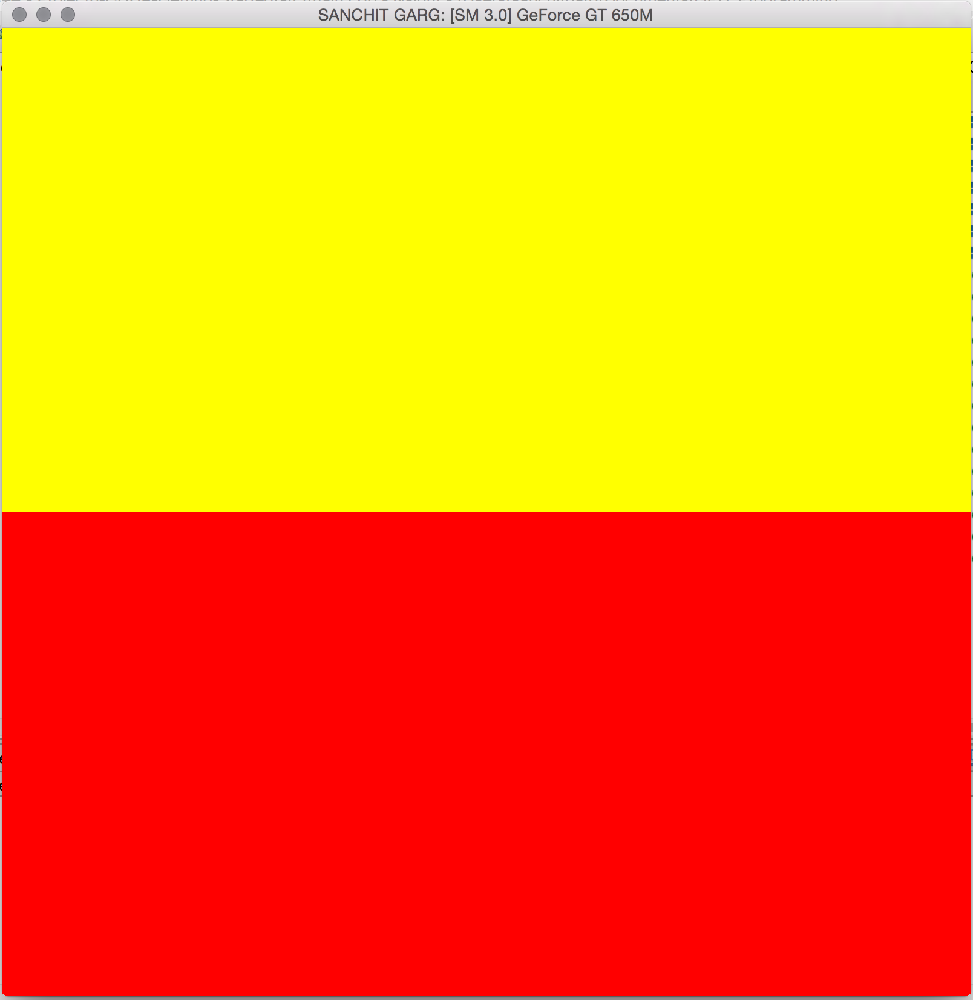
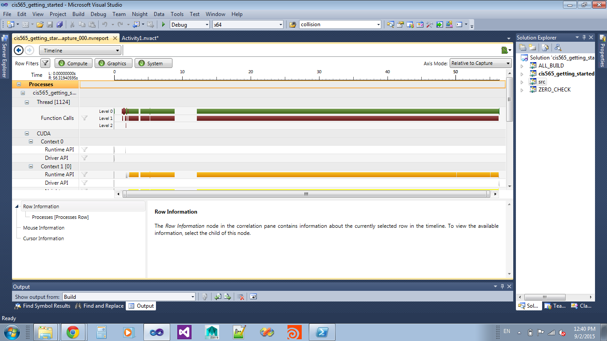

CUDA Getting Started
====================

**University of Pennsylvania, CIS 565: GPU Programming and Architecture, Project 0**

* SANCHIT GARG
* Tested on: Mac OSX 10.10.4, i7 @ 2.4 GHz, GT 650M 1GB (Personal Computer)

### SANCHIT GARG: ReadMe

Include screenshots, analysis, etc. (Remember, this is public, so don't put
anything here that you don't want to share with the world.)

Instructions (delete me)
========================

This is due **Wednesday, September 2**.

**Summary:** In this project, you will set up your CUDA development tools and
verify that you can build, run, and do performance analysis.

This project is a simple program that demonstrates CUDA and OpenGL functionality
and interoperability, testing that CUDA has been properly installed. If the
machine you are working on has CUDA and OpenGL 4.0 support, then when you run
the program, you should see either one or two colors depending on your
graphics card.

This project (and all other CUDA projects in this course) requires an NVIDIA
graphics card with CUDA capability. Any card with Compute Capability 2.0
(`sm_20`) or greater will work. Gheck your GPU on this [compatibility
table](https://developer.nvidia.com/cuda-gpus).  If you do not have a personal
machine with these specs, you may use computers in the SIG Lab and Moore
100B/C.

**HOWEVER**: If you need to use the lab computer for your development, you will
not presently be able to do GPU performance profiling. This will be very
important for debugging performance bottlenecks in your program. If you do not
have administrative access to any CUDA-capable machine, please email the TA.

## ScreenShots

