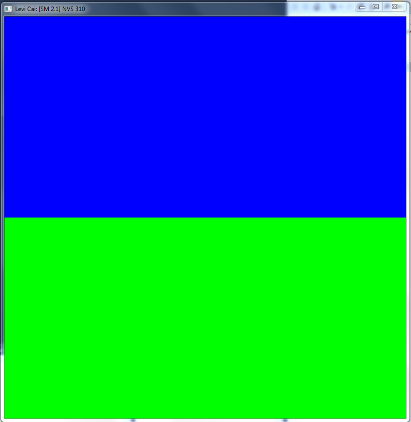

CUDA Getting Started
====================

**University of Pennsylvania, CIS 565: GPU Programming and Architecture, Project 0**

* Levi Cai
* Tested on: Windows 7, i7-4770 @ 3.40GHz 16GB, NVidia NVS 310 512MB (Moore 100C Lab)

## Submit
1. Open a GitHub pull request so that we can see that you have finished.
   The title should be "Submission: YOUR NAME".
2. Send an email to the TA (gmail: kainino1+cis565@) with:
   * **Subject**: in the form of `[CIS565] Project 0: PENNKEY`
   * Direct link to your pull request on GitHub
   * In the form of a grade (0-100+), evaluate your own performance on the
     project.
     (N/A for Project 0.)
   * Feedback on the project itself, if any.

And you're done!
