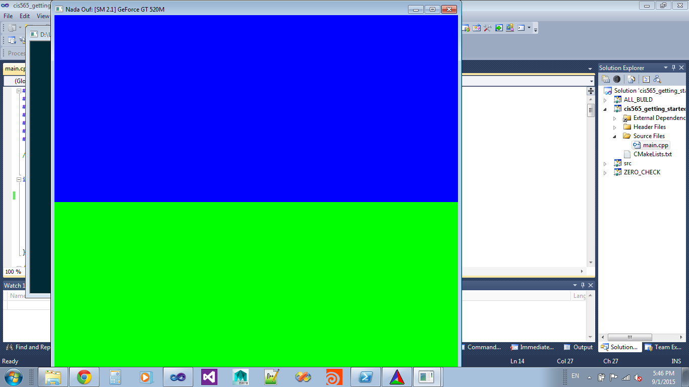

CUDA Getting Started
====================

**University of Pennsylvania, CIS 565: GPU Programming and Architecture, Project 0**

* Sally Kong
* Tested on:Windows 8.1, i5-4670k @ 3.40GHz 3.40GHz 16.0GB, GTX 770 4.0GB (Personal desktop)

